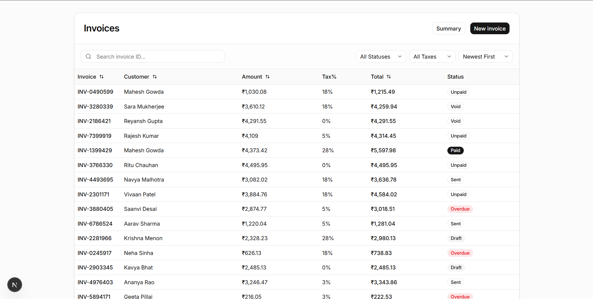
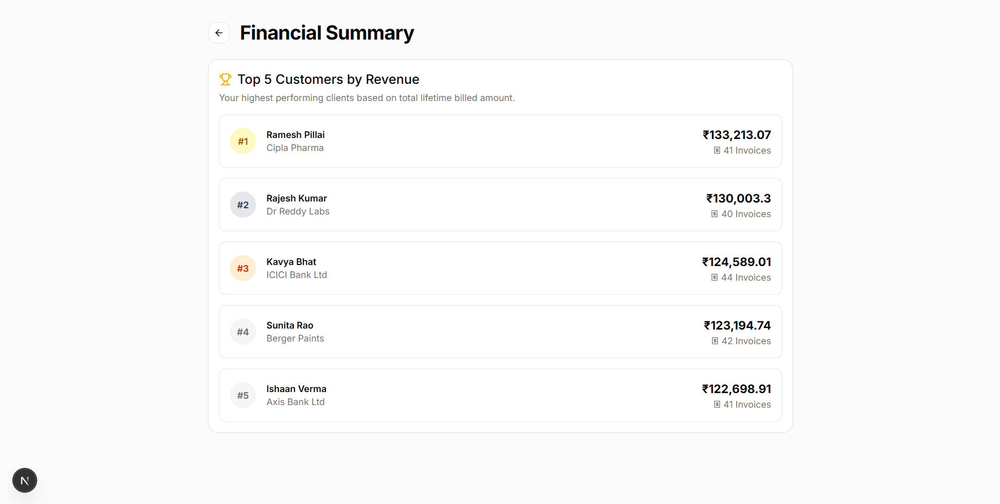
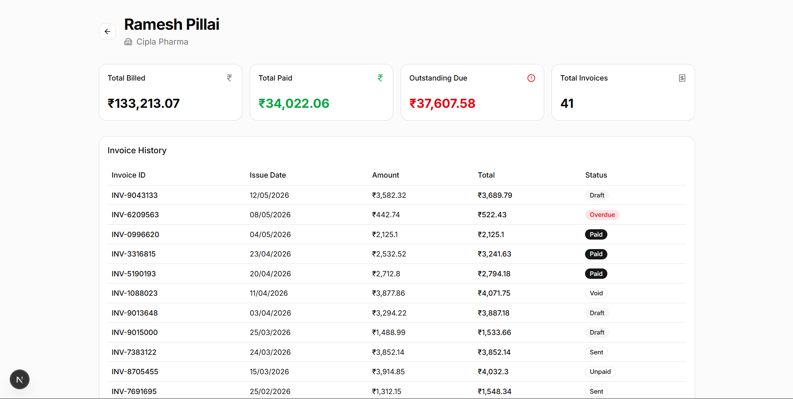

# ⚡ Powerplay: B2B Invoice Management Dashboard

A full-stack, responsive dashboard built for tracking, creating, and managing client invoices. Developed as a take-home assignment for the Software Development Engineer Internship at Powerplay.





## 🚀 Tech Stack

**Frontend:**
* Next.js 15 (App Router)
* React & TypeScript
* Tailwind CSS
* Shadcn UI & Radix UI (Headless components)
* Lucide React (Icons)

**Backend:**
* Node.js & Express
* MongoDB & Mongoose (ODM)
* CORS & Dotenv

---

## ✨ Key Features

1. **Robust Data Grid:** Paginated table displaying invoice records (20 items per page) powered by server-side fetching.
2. **Dynamic Filtering & Sorting:** Real-time search by Invoice ID, and server-side filtering by Tax Rate, Status, and Date Sorting.
3. **Advanced MongoDB Aggregations:** A dedicated Summary Dashboard highlighting the "Top 5 Customers" calculated via complex `$lookup` and `$group` aggregation pipelines.
4. **Dynamic Routing:** Individual, dynamic customer profile pages (`/customer/[id]`) displaying summarized metrics (Total Revenue, Total Paid, Outstanding Due) utilizing JavaScript `.reduce()` calculations.
5. **Seamless CRUD Operations:** A centralized, state-aware Modal component handling both the creation of new invoices (POST) and the real-time editing/recalculation of existing ones (PUT).

---

## 🧪 Manual Test Cases Executed

Given the 48-hour timeframe, I opted for comprehensive manual testing of critical user flows and API endpoints to ensure system stability, math accuracy, and data integrity. 

| Feature Category | Test Case Scenario | Expected Result | Status |
| :--- | :--- | :--- | :--- |
| **API & Pagination** | Request page 2 of invoices with limit set to 20. | Server returns items 21-40 with accurate `totalRecords` and `totalPages` metadata. | ✅ Pass |
| **Search Functionality** | Enter partial string `INV-12` in the search bar. | Backend `$regex` matching successfully returns all invoices containing "INV-12". | ✅ Pass |
| **Filter Integration** | Change UI Status dropdown to "Paid" and Tax to "18%". | React state resets pagination to Page 1; server returns only Paid invoices with 18% tax. | ✅ Pass |
| **Math Integrity (Create)** | Submit `POST` to create invoice with amount `1000` and tax `18`. | Server ignores frontend total, dynamically calculates `tax = 180` and `total = 1180` before saving. | ✅ Pass |
| **Data Integrity (Update)** | Submit `PUT` modifying the amount on an existing invoice. | Server updates amount and instantly recalculates the dependent Tax and Total fields. | ✅ Pass |
| **Error Handling** | Submit `POST` payload missing the required `customerId`. | Server rejects the request and returns a `400 Bad Request` with an error message. | ✅ Pass |
| **Complex Aggregations** | Verify the "Top 5 Customers" leaderboard data. | The `$lookup` and `$group` pipeline accurately sums lifetime revenue across all seed data. | ✅ Pass |
| **Dynamic Routing** | Click a specific customer on the Summary page. | Next.js correctly parses the `[id]` parameter and fetches the correct Customer Profile metrics. | ✅ Pass |

## 🛠️ Local Setup & Quick Start

To run this project locally, you will need to run bun run dev.

### 1. Database Setup
1. Create a `.env` file in the `/backend` directory.
2. Add your MongoDB connection string:
   `MONGO_URI=mongodb+srv://<username>:<password>@cluster...`
3. Run the database seeder to populate dummy data:
   ```bash
   cd backend
   bun run seed.ts

